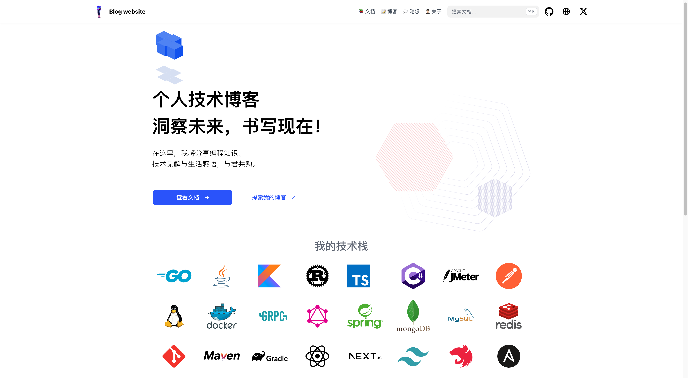

<!DOCTYPE html>

<html>
<head>
</head>
<body>
    <h1 align="center">Personal blog</h1>
    <p align="center">
        
        
        
        
    </p>
    <p align="center">
        <a href="#Tech stack">🪂 Tech stack</a> &#xa0; | &#xa0;
        <a href="#Website">🕸️ Website</a> &#xa0; | &#xa0;
        <a href="https://github.com/wylu1037" target="_blank">🧑🏽‍💻 Author</a>
    </p>
    <br>
    <p align="center" style="margin-top:20px; margin-bottom:50px;box-shadow:3px 2px 60px 2px;"></p>

</body>
</html>

## 🪂 Tech stack

- [Hugo: The world’s fastest framework for building websites](https://gohugo.io/)
- [Theme: hextra](https://imfing.github.io/hextra/)

## 🕸️ Website

- [x] [Click me to view blog](https://wylu1037.github.io/)
- [x] [See my resume](https://wylu1037.github.io/about/)

## 🚀 Start

run website server

```shell
hugo server
```
