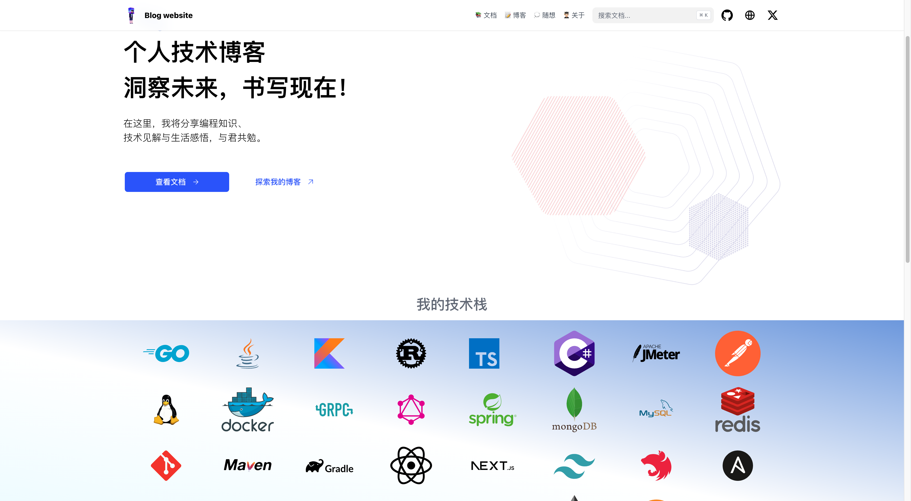

<!DOCTYPE html>

<html>
<head>
</head>
<body>
    <h1 align="center">Personal blog</h1>
    

    <a href="#Tech stack">🪂 Tech stack</a> &#xa0; | &#xa0;
    <a href="#Website">🕸️ Website</a> &#xa0; | &#xa0;
    <a href="https://github.com/wylu1037" target="_blank">🧑🏽‍💻 Author</a>
    

     
    

</body>
</html>

## 🪂 Tech stack

+ [Hugo: The world’s fastest framework for building websites](https://gohugo.io/)
+ [Theme: hextra](https://imfing.github.io/hextra/)

## 🕸️ Website

[Click me to view blog](https://wylu1037.github.io/)