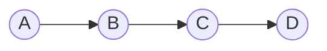
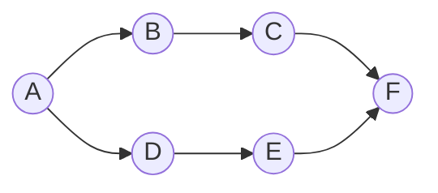
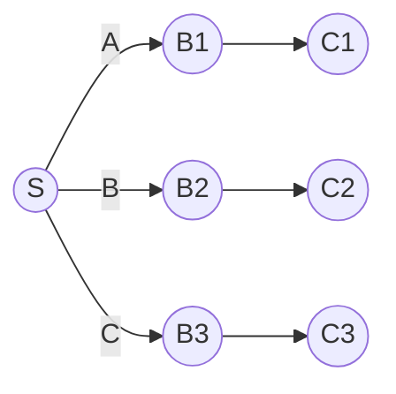

## Extended
### Diagram


### Code
```python {hl_lines=[20,21,22]}
from dotenv import load_dotenv
from langchain.prompts import ChatPromptTemplate
from langchain.schema.output_parser import StrOutputParser
from langchain_openai import ChatOpenAI

# Load environment variables from .env
load_dotenv()

# Create a ChatOpenAI model
model = ChatOpenAI(model="gpt-4o")

# Define prompt templates (no need for separate Runnable chains)
prompt_template = ChatPromptTemplate.from_messages(
    [
        ("system", "You are a comedian who tells jokes about {topic}."),
        ("human", "Tell me {joke_count} jokes."),
    ]
)

# Create the combined chain using LangChain Expression Language (LCEL)
chain = prompt_template | model | StrOutputParser()
# chain = prompt_template | model

# Run the chain
result = chain.invoke({"topic": "lawyers", "joke_count": 3})

# Output
print(result)

```

## Parallel
### Diagram


### Code

+ Runnable Sequences(alias chains)
+ Runnables
+ Runnable lambdas

```python
from dotenv import load_dotenv
from langchain.prompts import ChatPromptTemplate
from langchain.schema.output_parser import StrOutputParser
from langchain.schema.runnable import RunnableParallel, RunnableLambda
from langchain_huggingface import HuggingFaceEndpoint, ChatHuggingFace
import os

# Load environment variables from .env
load_dotenv()

# Create a ChatOpenAI model
# model = ChatOpenAI(model="gpt-4o")
llm = HuggingFaceEndpoint(
    repo_id="HuggingFaceTB/SmolLM2-360M-Instruct",
    task="text-generation",
    max_new_tokens=512,
    temperature=0.7,
    huggingfacehub_api_token=os.environ["HUGGINGFACE_API_KEY"]
)
model = ChatHuggingFace(llm=llm, verbose=True)

# Define prompt template
prompt_template = ChatPromptTemplate.from_messages(
    [
        ("system", "You are an expert product reviewer."),
        ("human", "List the main features of the product {product_name}."),
    ]
)


# Define pros analysis step
def analyze_pros(features):
    pros_template = ChatPromptTemplate.from_messages(
        [
            ("system", "You are an expert product reviewer."),
            (
                "human",
                "Given these features: {features}, list the pros of these features.",
            ),
        ]
    )
    return pros_template.format_prompt(features=features)


# Define cons analysis step
def analyze_cons(features):
    cons_template = ChatPromptTemplate.from_messages(
        [
            ("system", "You are an expert product reviewer."),
            (
                "human",
                "Given these features: {features}, list the cons of these features.",
            ),
        ]
    )
    return cons_template.format_prompt(features=features)


# Combine pros and cons into a final review
def combine_pros_cons(pros, cons):
    return f"Pros:\n{pros}\n\nCons:\n{cons}"


# Simplify branches with LCEL
pros_branch_chain = (
    RunnableLambda(lambda x: analyze_pros(x)) | model | StrOutputParser()
)

cons_branch_chain = (
    RunnableLambda(lambda x: analyze_cons(x)) | model | StrOutputParser()
)

# Create the combined chain using LangChain Expression Language (LCEL)
chain = (
    prompt_template
    | model
    | StrOutputParser()
    | RunnableParallel(branches={"pros": pros_branch_chain, "cons": cons_branch_chain})
    | RunnableLambda(lambda x: combine_pros_cons(x["branches"]["pros"], x["branches"]["cons"]))
)

# Run the chain
result = chain.invoke({"product_name": "MacBook Pro"})

# Output
print(result)

```

## Branching
### Diagram


### Code
```python
from dotenv import load_dotenv
from langchain.prompts import ChatPromptTemplate
from langchain.schema.output_parser import StrOutputParser
from langchain.schema.runnable import RunnableBranch
from langchain_huggingface import HuggingFaceEndpoint, ChatHuggingFace
import os

# Load environment variables from .env
load_dotenv()

# Create a ChatOpenAI model
# model = ChatOpenAI(model="gpt-4o")
llm = HuggingFaceEndpoint(
    repo_id="microsoft/Phi-3-mini-4k-instruct",
    task="text-generation",
    max_new_tokens=512,
    do_sample=False,
    repetition_penalty=1.03,
    huggingfacehub_api_token=os.environ["HUGGINGFACE_API_KEY"]
)
model = ChatHuggingFace(llm=llm, verbose=True)

# Define prompt templates for different feedback types
positive_feedback_template = ChatPromptTemplate.from_messages(
    [
        ("system", "You are a helpful assistant."),
        ("human",
         "Generate a thank you note for this positive feedback: {feedback}."),
    ]
)

negative_feedback_template = ChatPromptTemplate.from_messages(
    [
        ("system", "You are a helpful assistant."),
        ("human",
         "Generate a response addressing this negative feedback: {feedback}."),
    ]
)

neutral_feedback_template = ChatPromptTemplate.from_messages(
    [
        ("system", "You are a helpful assistant."),
        (
            "human",
            "Generate a request for more details for this neutral feedback: {feedback}.",
        ),
    ]
)

escalate_feedback_template = ChatPromptTemplate.from_messages(
    [
        ("system", "You are a helpful assistant."),
        (
            "human",
            "Generate a message to escalate this feedback to a human agent: {feedback}.",
        ),
    ]
)

# Define the feedback classification template
classification_template = ChatPromptTemplate.from_messages(
    [
        ("system", "You are a helpful assistant."),
        ("human",
         "Classify the sentiment of this feedback as positive, negative, neutral, or escalate: {feedback}."),
    ]
)

# Define the runnable branches for handling feedback
branches = RunnableBranch(
    (
        lambda x: "positive" in x,
        positive_feedback_template | model | StrOutputParser()  # Positive feedback chain
    ),
    (
        lambda x: "negative" in x,
        negative_feedback_template | model | StrOutputParser()  # Negative feedback chain
    ),
    (
        lambda x: "neutral" in x,
        neutral_feedback_template | model | StrOutputParser()  # Neutral feedback chain
    ),
    escalate_feedback_template | model | StrOutputParser()
)

# Create the classification chain
classification_chain = classification_template | model | StrOutputParser()

# Combine classification and response generation into one chain
chain = classification_chain | branches

# Run the chain with an example review
# Good review - "The product is excellent. I really enjoyed using it and found it very helpful."
# Bad review - "The product is terrible. It broke after just one use and the quality is very poor."
# Neutral review - "The product is okay. It works as expected but nothing exceptional."
# Default - "I'm not sure about the product yet. Can you tell me more about its features and benefits?"

review = "The product is terrible. It broke after just one use and the quality is very poor."
result = chain.invoke({"feedback": review})

# Output the result
print(result)

```
